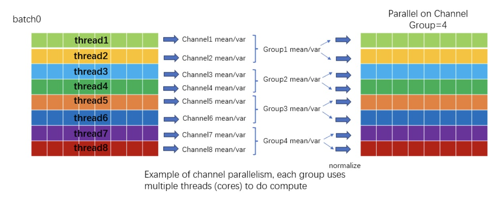

👋 Hi there! I am CAI Yiyang (蔡逸扬), a Ph.D. student of Hong Kong University of Science and Technology. I am supervised by  Prof. <a href="https://facultyprofiles.hkust.edu.hk/profiles.php?profile=yike-guo-yikeguo" target="_blank">GUO Yike</a>  and Prof. <a href="https://whluo.github.io/" target="_blank">LUO Wenhan</a>. My research interests include computer vision and generative models. My main focusing topic is about <strong>personalized content generation</strong>. 

📝 Publication
======

    

        <video src="../assets/multimedia/freecure-video.mp4" width="320" controls loop></video>
    

    

        <h3>Foundation Cures Personalization: Improving Personalized Models' Prompt Consistency via Hidden Foundation Knowledge</h3>
        
 <strong>Yiyang Cai</strong>, Zhengkai Jiang, Yulong Liu, Chunyang Jiang, Wei Xue, Wenhan Luo, Yike Guo  
            <strong>Technical Report, 2024</strong>  
            <a href="https://arxiv.org/pdf/2411.15277" target="_blank"><strong>[arxiv]</strong></a>
            <a href="https://github.com/YIYANGCAI/FreeCure" target="_blank"><strong>[code]</strong></a>
            <a href="https://freecure.github.io/" target="_blank"><strong>[page]</strong></a>
        

    

    

        </img>
    

    

        <h3>Optimize weight rounding via signed gradient descent for the quantization of llms</h3>
        
 Wenhua Cheng, Weiwei Zhang, Haihao Shen, <strong>Yiyang Cai</strong>, Xin He, Kaokao Lv, Yi Liu  
            <strong>Findings of EMNLP, 2024</strong>  
            <a href="https://arxiv.org/pdf/2309.05516" target="_blank"><strong>[arxiv]</strong></a>
            <a href="https://github.com/intel/auto-round" target="_blank"><strong>[code]</strong></a>
        

    

    

        </img>
    

    

        <h3>Effective Quantization for Diffusion Models on CPUs</h3>
        
 Hanwen Chang, Haihao Shen, <strong>Yiyang Cai</strong>, Xinyu Ye, Zhenzhong Xu, Wenhua Cheng, Kaokao Lv, Weiwei Zhang, Yintong Lu, Heng Guo  
            <strong>Neural Information Processing Systems (NeurIPS) 2023 Workshop on Diffusion Models.</strong>  
            <a href="https://arxiv.org/pdf/2311.16133" target="_blank"><strong>[arxiv]</strong></a>
        

    

    

        </img>
    

    

        <h3>TEQ: Trainable equivalent transformation for quantization of LLMs</h3>
        
 Wenhua Cheng, <strong>Yiyang Cai</strong>, Kaokao Lv, Haihao Shen  
            <strong>Technical Report, 2023</strong>  
            <a href="https://arxiv.org/pdf/2310.10944" target="_blank"><strong>[arxiv]</strong></a>
            <a href="https://github.com/intel/neural-compressor/tree/master/neural_compressor/adaptor/torch_utils" target="_blank"><strong>[code]</strong></a>
        

    

    

        </img>
    

    

        <h3>Few-shot font generation by learning fine-grained local styles</h3>
        
 Licheng Tang*, <strong>Yiyang Cai*</strong>, Jiaming Liu, Zhibin Hong, Mingming Gong, Minhu Fan, Junyu Han, Jingtuo Liu, Errui Ding, Jingdong Wang ('*' means equal contribution)  
            <strong>CVPR 2022<strong>  
            <a href="https://openaccess.thecvf.com/content/CVPR2022/papers/Tang_Few-Shot_Font_Generation_by_Learning_Fine-Grained_Local_Styles_CVPR_2022_paper.pdf" target="_blank"><strong>[paper]</strong></a>
            <a href="https://github.com/tlc121/FsFont" target="_blank"><strong>[code]</strong></a>
        

    

